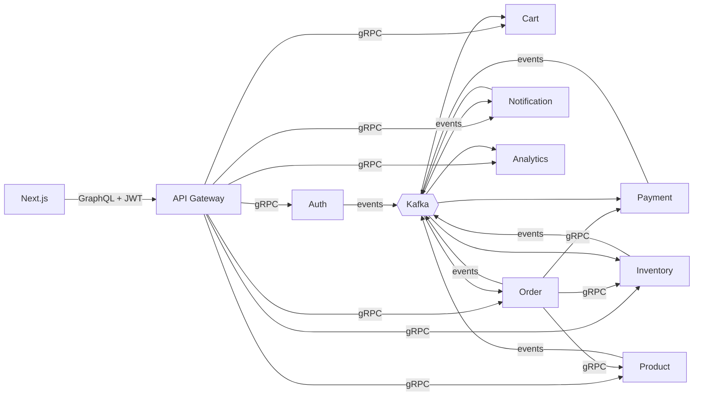

<<<<<<< HEAD
# EventFlow Commerce

An event-driven e-commerce platform built as **real microservices**: NestJS services talking over **gRPC** (synchronous) and **Kafka** (asynchronous), fronted by a **GraphQL** gateway and a **Next.js** storefront. Everything runs with one command. Payments are **simulated**; no real money or card data is involved.

**Stack:** TypeScript · Node.js · NestJS · Next.js · React · Tailwind · Apollo (Server + Client) · GraphQL · gRPC / Protocol Buffers · Apache Kafka (KRaft) · PostgreSQL · Prisma · Redis · Docker / Docker Compose · Jest / Supertest · ESLint / Prettier · GitHub Actions


More diagrams (microservices, Kafka flow, gRPC, order lifecycle, ER) in [docs/architecture.md](docs/architecture.md).

## Quick start
Requires Docker with Compose v2 (about 4 GB RAM free). First build takes a few minutes.
```bash
git clone <your-repo-url> eventflow-commerce && cd eventflow-commerce
cp .env.example .env          # optional: defaults work out of the box
docker compose up --build     # npm run up does the same
```
| What | URL |
|---|---|
| Storefront | http://localhost:3000 |
| GraphQL (Apollo Sandbox) | http://localhost:4000/graphql |
| Gateway health | http://localhost:4000/health (each service: `:3001`-`:3008/health`) |

Schema and seed data are applied automatically when each container starts (no manual migrations). Stop with `docker compose down` (add `-v` to wipe data).

**Demo accounts (fake, local only):** `demo@eventflow.dev / Demo@12345` · admin: `admin@eventflow.dev / Admin@12345`

## Things to try
1. **Happy path:** log in as demo, add products, check out. Watch the order go `PENDING -> PAID` (the page updates itself) and a notification arrive on your profile.
2. **Payment failure:** order more than $1,000 (e.g. 3 x 4K Monitor). The simulated payment is declined, the order becomes `PAYMENT_FAILED`, reserved stock is released and you get a notification.
3. **Stock limits:** the Ergonomic Chair has 10 units. Order 11 and the order is `REJECTED` by the inventory gRPC call.
4. **Cancel:** cancel a `PAID` order. Stock is restocked and the simulated payment refunded.
5. **Admin:** log in as admin: manage products, set stock, ship orders (`PAID -> SHIPPED -> DELIVERED`), and watch the live Kafka event stream and revenue dashboard.

## Services
| Service | Ports (gRPC / HTTP) | Responsibility |
|---|---|---|
| api-gateway | n/a / 4000 | GraphQL API, JWT + role enforcement, rate limiting, error mapping |
| auth-service | 50061 / 3001 | register/login, bcrypt (12 rounds), JWT |
| product-service | 50062 / 3002 | catalogue, Redis cache, admin-only writes |
| cart-service | 50054 / 3006 | per-user cart with live prices; cleared by `order.created` |
| order-service | 50053 / 3005 | checkout orchestration, order state machine, compensation |
| inventory-service | 50051 / 3003 | atomic stock reservation, confirm/release on payment events |
| payment-service | 50052 / 3004 | **simulated** payments PENDING -> PROCESSING -> COMPLETED/FAILED, refunds |
| notification-service | 50055 / 3007 | turns events into user notifications |
| analytics-service | 50056 / 3008 | records every event, admin metrics |

**Sync vs async:** gRPC when a caller needs an answer now (price a product, reserve stock, create a payment record); Kafka when something happened and others react independently. Details: [docs/grpc.md](docs/grpc.md), [docs/kafka.md](docs/kafka.md), [docs/graphql.md](docs/graphql.md), [docs/database.md](docs/database.md).

### Order workflow
`createOrder` -> price from product-service (gRPC) -> save `PENDING` -> `ReserveStock` (gRPC, atomic) -> `CreatePayment` (gRPC) -> publish `order.created` -> payment-service processes -> `payment.completed | payment.failed` -> order updated, inventory confirmed or released, notification sent, analytics recorded. If stock is short, or payment-service/Kafka is unavailable after reserving, the order is `REJECTED` and stock is released.

## Why Redis
- **Product cache** (product-service): read-through cache, 60-300 s TTL, invalidated on every write; the service still works if Redis is down.
- **Rate limiting** (gateway): per-IP fixed window (login/register 10/min, everything else 120/min).
- **Logout / token revocation** (gateway): JWTs are stateless, so `logout` blacklists the token until it expires.

## Security
bcrypt password hashing · JWT (HS256, 1 h) · roles enforced in the gateway **and** re-checked in services · identity taken from the verified token, never from request fields · order prices computed server-side from the cart · input validation (class-validator, whitelist) · CORS allow-list · generic error messages for internal failures · secrets only via env (`.env` is git-ignored).
Local-demo caveats: the default `JWT_SECRET` in compose is for development only, and the browser keeps the token in `localStorage` (use httpOnly cookies in production).

## Developing
```bash
npm install            # one npm-workspaces install for everything
npm run infra          # only postgres + redis + kafka in Docker
npm run build          # prisma generate + compile all services + next build
npm test               # Jest across all workspaces (83 tests incl. Supertest GraphQL API tests)
npm run lint           # ESLint
npm run format         # Prettier
npm run dev            # full stack with dev overrides (faster payments, relaxed rate limit)
```
Run a single service on your machine with `DATABASE_URL`, `KAFKA_BROKERS=localhost:29092`, `REDIS_URL`, `JWT_SECRET` and the `*_GRPC_URL` variables set (see `.env.example`), then `npm run dev -w services/<name>`.

## Testing
83 meaningful tests: password hashing and token checks, duplicate email, cache invalidation, atomic reservation (insufficient stock rolls back), idempotent event handling, saga compensation, payment/cancel race conditions, role enforcement over the real GraphQL schema, error masking, rate limiting, frontend validation helpers.
Not covered: browser/UI tests and full-stack integration against real Kafka/Postgres (run the stack and use the scenarios above).

## CI/CD
`.github/workflows/ci.yml`: `npm ci` -> lint -> build (incl. Prisma generate + Next build) -> tests -> `docker compose config` -> builds all 10 Docker images in a matrix.

## Project structure
```
apps/frontend, apps/api-gateway
services/{auth,product,cart,order,inventory,payment,notification,analytics}-service   (each: Dockerfile via shared template, prisma/, src/, tests)
packages/proto            .proto contracts
packages/kafka-events     topics, typed events, producer, consumer (retry + dead-letter)
packages/service-common   gRPC client/server helpers, JWT helpers
infrastructure/docker     service + frontend Dockerfiles, DB init SQL
docs/  .github/workflows/  docker-compose.yml  docker-compose.dev.yml  .env.example
```
Differences from the suggested layout: Prisma schemas live inside each service (database-per-service) instead of one root `prisma/` folder; protos are in `packages/proto`; event types live in `kafka-events`, so there is no separate `shared-types`/`config` package; one parametrised Dockerfile builds every backend service.

## Known limitations / next steps
No transactional outbox (DB write + Kafka publish is not atomic; compensation covers common failures) · schema applied with `prisma db push` rather than versioned migrations · single Kafka broker · no sample orders seeded · no browser E2E tests · logs are leveled and timestamped text (swap for JSON logging in production) · rate limiting and revocation fail open if Redis is down.

## Troubleshooting
- **First build is very slow or seems stuck:** the Dockerfiles install dependencies once from `package-lock.json` and reuse that layer for every service. Build one service first so the shared layer is cached, then the rest: `docker compose build auth-service` then `docker compose build`. A slow network (many seconds per npm request) makes the first build take longer, but later builds reuse the cache.
- **A container restarts at first boot:** services wait for Kafka/Postgres and retry; give it 1-2 minutes. `docker compose ps` shows health.
- **Frontend cannot reach the API:** `NEXT_PUBLIC_GRAPHQL_URL` is baked in at build time; set `PUBLIC_GRAPHQL_URL` in `.env` and rebuild (`docker compose build frontend`).
- **Port already in use:** change the left side of the `ports:` mapping in `docker-compose.yml`.
- **Reset everything:** `docker compose down -v`.

MIT licensed (replace the name in `LICENSE`).
=======
# EventFlow
Eventflow Project
>>>>>>> origin/main
