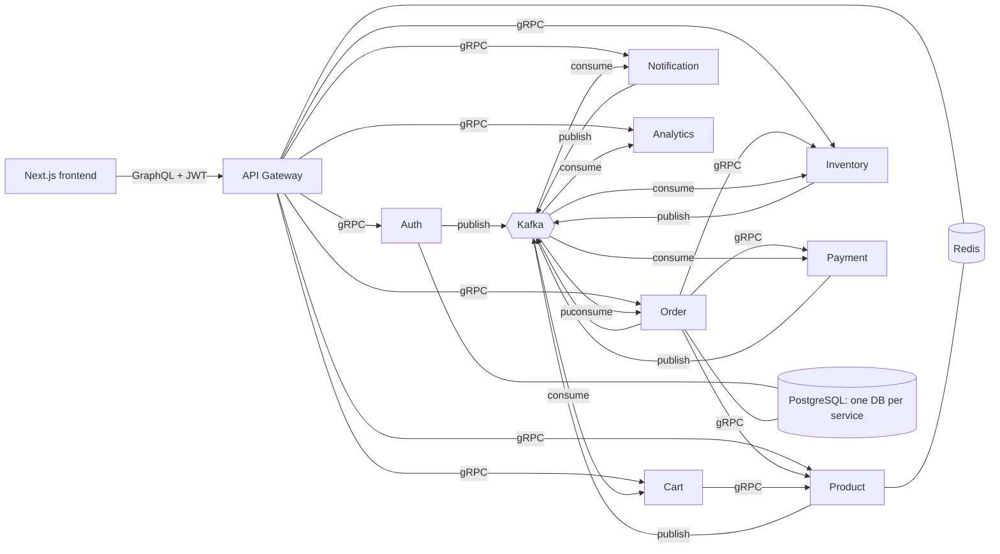
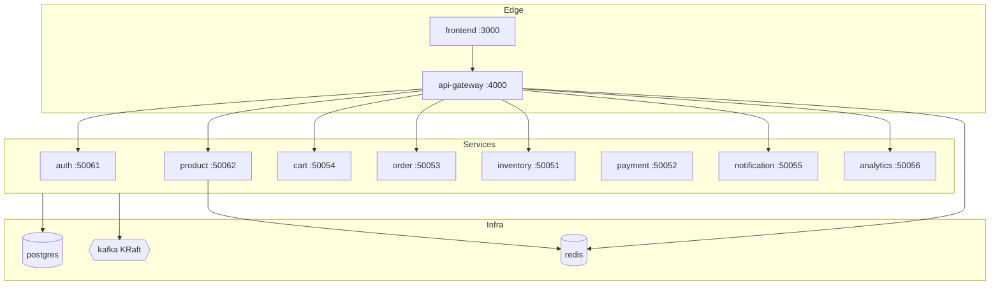
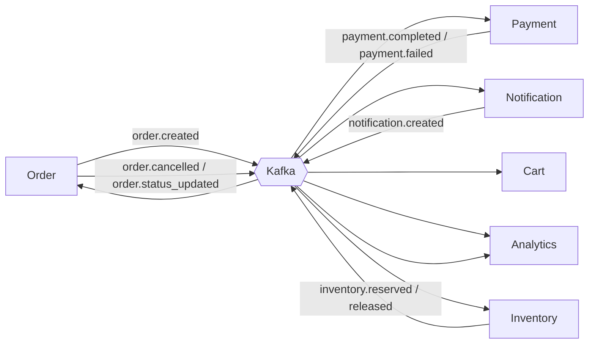
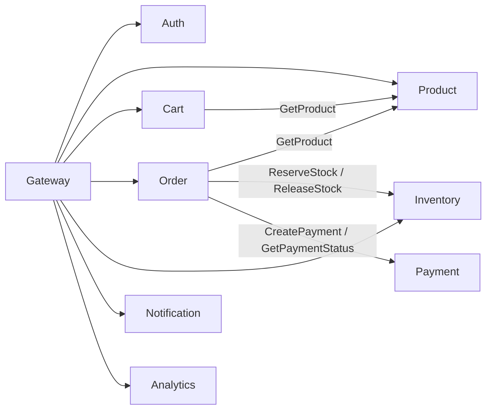
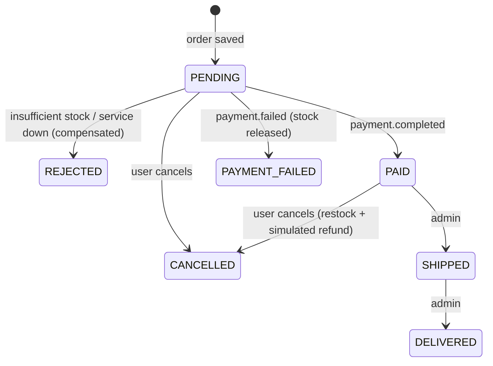

# Architecture

## 1. Overall

## 2. Microservices

Each service owns its database (`auth_db`, `product_db`, ...). Nothing reads another service's tables; services share only IDs, gRPC contracts and Kafka events.

## 3. Kafka event flow

## 4. gRPC (synchronous)

## 5. Order lifecycle

Every transition is a conditional update (`WHERE status = ...`), so duplicate or out-of-order events are harmless.

## 6. Database relationships
See [database.md](database.md).

## Sync vs async
- **gRPC** when the caller needs an answer *now* (price a product, reserve stock, create a payment record).
- **Kafka** when something *happened* and other services react in their own time (payment finished, notify the user, record analytics).

## Trade-offs
- No transactional outbox: a DB write followed by a Kafka publish is not atomic. Order creation compensates (releases stock, marks `REJECTED`) if publishing fails.
- Payment processing sleeps inside the consumer handler to simulate latency, which blocks that partition. Fine for a demo.
- Gateway fails open if Redis is down (rate limiting and logout revocation pause, requests keep working).
