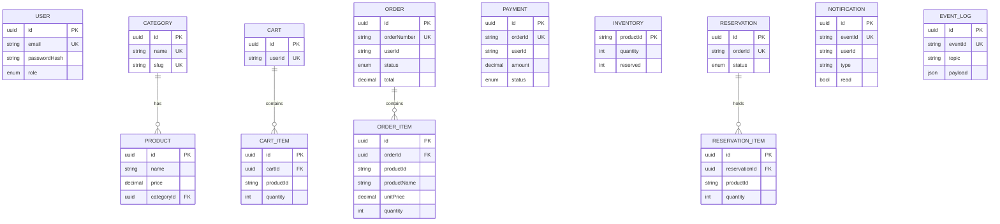

# Database

One PostgreSQL server, **one database per service** (created by `infrastructure/docker/init-databases.sql`). Schemas are Prisma models in `services/<name>/prisma/schema.prisma`, applied on container start with `prisma db push`; seed scripts are idempotent upserts. Cross-service references (userId, productId, orderId) are plain string IDs, deliberately **without** foreign keys across databases.

| Service DB | Tables | Notable constraints / indexes |
|---|---|---|
| auth_db | User | unique email, index role |
| product_db | Category, Product | unique name/slug, FK Product->Category, indexes on categoryId, name |
| cart_db | Cart, CartItem | unique userId, unique (cartId, productId) |
| order_db | Order, OrderItem | unique orderNumber, index (userId, createdAt), index status, cascade delete items |
| inventory_db | Inventory, Reservation, ReservationItem | unique orderId (idempotent reserve), atomic conditional `UPDATE ... WHERE quantity - reserved >= n` |
| payment_db | Payment | unique orderId (one payment per order) |
| notification_db | Notification | unique eventId (dedupe), indexes (userId, createdAt) and (userId, read) |
| analytics_db | EventLog | unique eventId (dedupe), indexes (topic, occurredAt) and entityId |

The spec's `Role` entity is modelled as the `Role` enum (`USER`, `ADMIN`) on `User`. Money is `DECIMAL(10,2)`.

**Seed data:** 2 accounts (`demo@eventflow.dev / Demo@12345`, `admin@eventflow.dev / Admin@12345`), 4 categories, 12 products and stock for each. Product IDs are fixed UUIDs so the inventory seed lines up with the catalogue. No sample orders are seeded: place one in the UI to generate real events.
